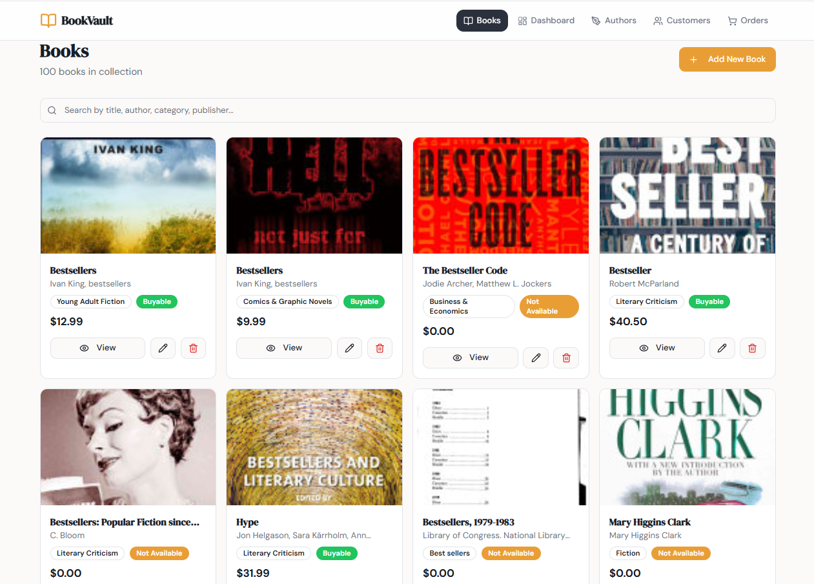

# 📚 Retail Store Sales Management System using MongoDB

<p align="center">
🛒 Data-Driven Retail Intelligence Platform
</p>

<p align="center">
  A full-stack web application designed to manage retail operations efficiently - leveraging MongoDB, REST APIs, and interactive dashboards to transform raw sales data into actionable business insights.
</p>

<p align="center">
  🌐 <a href="https://retail-store-sales-management-system-nrnfpdlac.vercel.app/" target="_blank"><strong>Live Application</strong></a>
</p>

## 📸 Application Preview



---

## 🔍 Project Summary

The **Retail Store Sales Management System** is a comprehensive full-stack application that enables efficient management of retail operations including:

* 📚 Product (Book) management
* 👥 Customer tracking
* 🧾 Order processing
* 📊 Sales analytics dashboard

This project demonstrates how raw data can be transformed into meaningful insights through:

* MongoDB data modeling
* Data cleaning and transformation
* Backend API development
* Frontend visualization and interaction

---

## 🎯 Key Objectives

1. **Efficient Data Management**
   Store and manage retail data using MongoDB collections.

2. **Full CRUD Functionality**
   Enable creation, retrieval, updating, and deletion of records.

3. **Real-Time Analytics**
   Provide insights into store performance through dashboards.

4. **System Integration**
   Connect frontend UI with backend API and MongoDB database.

5. **User-Friendly Interface**
   Build a clean and intuitive UI for seamless interaction.

---

## ❓ Core System Capabilities

### **1. Product (Books) Management**

* View all products in a clean card layout
* Search by title, author, category, or publisher
* Add new products
* Edit existing products
* Delete products

### **2. Customer Management**

* Store customer details
* Add and view customers
* Track customer interactions

### **3. Order Management**

* Create and manage orders
* Track purchases and transaction history
* Link orders to customers and products

### **4. Dashboard Analytics**

* Total products, customers, and orders
* Buyable vs non-buyable products
* Average price and page count
* Category and language distribution
* Sales insights through charts

---

## 🏗️ System Architecture

```text
Frontend (React + Vite + UI Components)
          ↓
     REST API (Express.js)
          ↓
     MongoDB Atlas Database
```

---

## 🧰 Technologies Used

### 🔹 Backend

* Node.js
* Express.js
* MongoDB Atlas
* Mongoose
* dotenv
* CORS

### 🔹 Frontend

* React (Vite)
* TypeScript
* Tailwind CSS / ShadCN UI
* Chart.js

### 🔹 Database

* MongoDB (NoSQL Document Database)

---

## 🗂️ Project Structure

```text
bookstorems-main/
│
├── server/                     # Backend
│   ├── index.js
│   ├── package.json
│   ├── .env
│
├── bookstorems-main/           # Frontend
│   ├── src/
│   │   ├── pages/
│   │   ├── components/
│   │   ├── data/
│   │   ├── types.ts
│   │
│   ├── package.json
│   ├── vite.config.ts
│
└── README.md
```

---

## 🗄️ Database Design

### 📚 books_clean (Products)

```json
{
  "title": "Book Title",
  "authors": ["Author 1"],
  "publisher": "Publisher",
  "categories": "Category",
  "list_price": 12.99,
  "buyable": true
}
```

### 👤 customers

```json
{
  "customer_id": "C001",
  "name": "John Doe",
  "email": "john@email.com",
  "city": "Nairobi"
}
```

### 🧾 orders

```json
{
  "order_id": "O001",
  "customer_id": "C001",
  "items": [
    { "book_id": "123", "quantity": 2, "price": 10 }
  ],
  "total_amount": 20
}
```

---

## 📊 Dashboard Insights

The dashboard provides real-time business intelligence:

* 📈 Total products, customers, and orders
* 💰 Average product pricing
* 📦 Product availability status
* 🏷️ Category distribution
* 🌍 Language distribution
* 📉 Sales patterns and trends

---

## ⚡ Setup Instructions

### 1. Clone Repository

```bash
git clone https://github.com/your-username/retail-store-sales-management-system.git
cd retail-store-sales-management-system
```

---

### 2. Backend Setup

```bash
cd server
npm install
```

Create `.env` file:

```env
PORT=5000
MONGO_URI=your_mongodb_connection_string
```

Run backend:

```bash
npm start
```

---

### 3. Frontend Setup

```bash
cd bookstorems-main
npm install
npm run dev
```

Frontend runs on:

```text
http://localhost:5173
```

---

## 🔗 API Endpoints

### 📚 Books

```http
GET     /api/books
POST    /api/books
PUT     /api/books/:id
DELETE  /api/books/:id
```

### 👤 Customers

```http
GET     /api/customers
POST    /api/customers
```

### 🧾 Orders

```http
GET     /api/orders
POST    /api/orders
```

---

## 🧹 Data Processing

Data preparation included:

* Converting authors from string → array
* Handling missing/null values
* Standardizing numeric fields
* Structuring documents for MongoDB
* Creating clean working dataset (`books_clean`)

---

## 🔍 Key Learning Outcomes

* NoSQL database design using MongoDB
* Backend API development with Express
* Frontend-backend integration
* Data cleaning and transformation
* Dashboard development and analytics
* Managing multiple collections

---

## 🚀 Future Improvements

* 🔐 User authentication (Admin roles)
* 💳 Payment integration
* 📦 Inventory tracking
* 📊 Advanced analytics (sales forecasting)
* ☁️ Deployment (Render / Vercel)
* 📄 Export reports (CSV / PDF)

---

## 📄 License

This project is for academic and educational purposes.

---